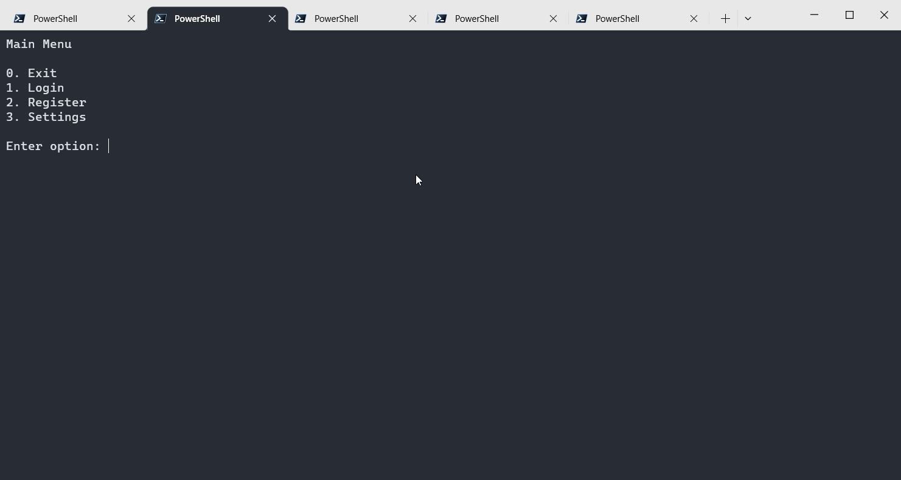
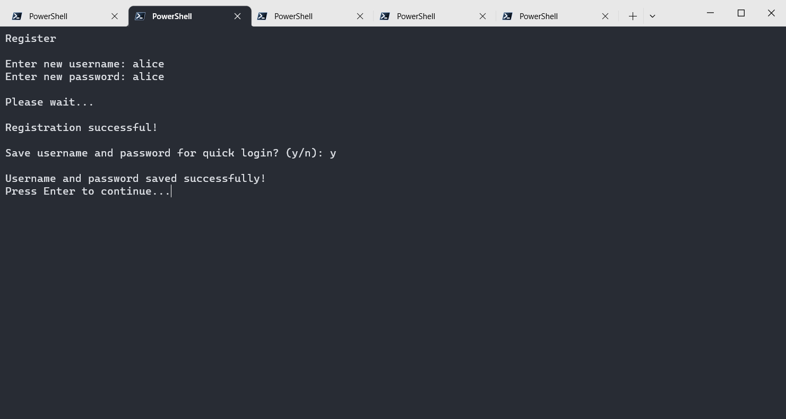
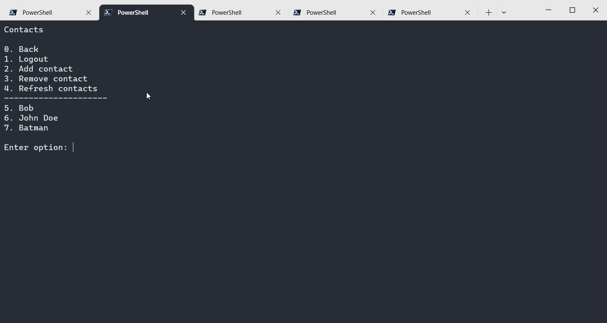
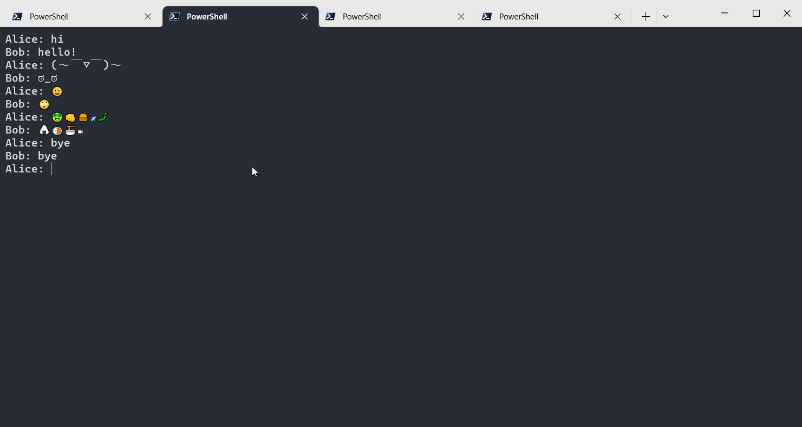
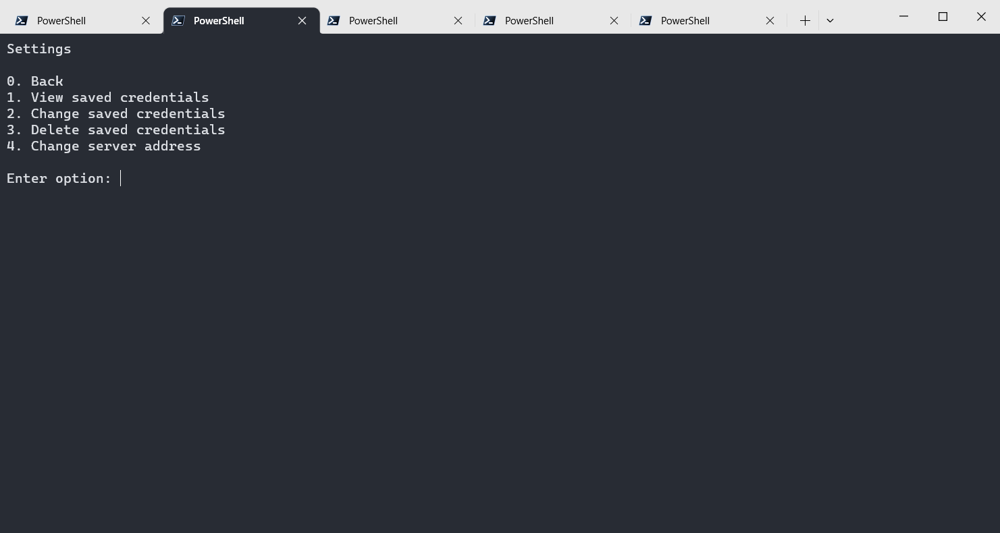

# Server

## Usage
- The server can be started with `python ./server/server.py`.  
- The server can be stopped by running `python ./server/terminate.py` or by closing the terminal.

## Config
The ip address and port can be configured with the following steps:
- Start the server.
- Open `./server/config.json` in a text editor
- Change the value of `"server-addr"` to the desired ip address and port in the format `"tcp://[ip address]:[port]"`. Default is `"tcp://*:3000"` (binds to port 3000 on all ips).
- Restart the server.

# Client

## Usage
- The client app can be started with `python ./client/client.py`.

## Interface

### Main Menu

### Register
First, register yourself by creating a username and password.  
If username is already taken, you will be prompted to choose another one.  
You will be asked if you want to save your credentials locally for auto-login.

### Contacts
After registering, you can login and will be taken to the contacts page.  
Here you can see all your contacts and add/remove them.

### Chat Window
Select a contact to open the chat window.

Type anything and press enter to send a message.  
Type `!r` to refresh and fetch new messages.  
Type `!b` to go back to the contacts page.

### Settings
You can view/modify the saved credentials and change the server address in the settings page.  
The app must be restarted for any changes to take effect.  
These settings are saved in `./client/config.json`

## Tips
- If there is no `back` or `cancel` option, type `!b` and press enter to go back.
- Unicode and emoji support depends on the terminal you are using.  
- Save your credentials either while registering or later in the settings page to avoid having to type them every time.

